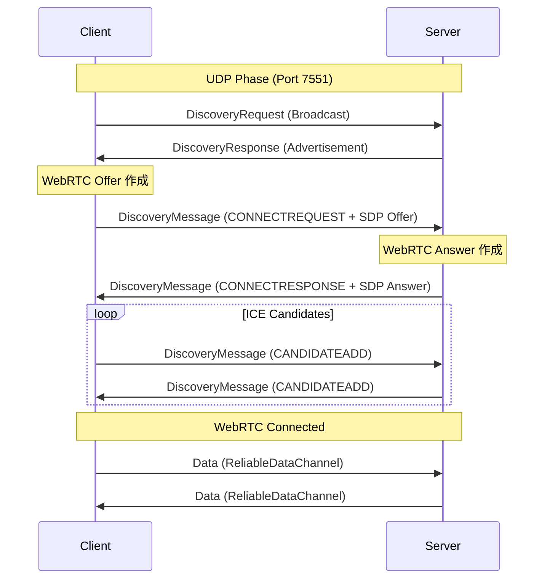

# NetherNet プロトコル仕様書

このドキュメントは `node-nethernet` の実装に基づいた NetherNet プロトコルの仕様概要です。
NetherNet は、ローカルネットワーク上のピア発見（Discovery）と、WebRTC を用いた信頼性の高いデータ通信を組み合わせたプロトコルです。

## 1. 概要

以下の ID が接続の確立、およびネゴシエーションには必要になります:
1.  **Network ID**
    *   NetherNet のネットワーク (サーバー) を一意に識別するための `string` です。
    *   Xbox Live および LAN ワールドではランダムな `uint64` の値が設定されています。Realms の場合は UUID が使用されています。
2.  **Connection ID**
    *   NetherNet で接続を新たに確立する際にシグナリングのメッセージを一意に識別するための `uint64` です。
    *   ランダムな `uint64` の値が設定されています。

NetherNet の通信は大きく分けて 2 つのフェーズで構成されます。

1.  **Discovery & Signaling (UDP)**:
    *   UDP ブロードキャスト（ポート 7551）を使用してネットワーク内のピアを発見します。
    *   発見後、WebRTC の接続確立に必要な SDP (Session Description Protocol) や ICE Candidate の交換（シグナリング）もこの UDP 通信上で行われます。
    *   パケットは暗号化され、署名されています。

2.  **Data Transport (WebRTC)**:
    *   確立された WebRTC 接続上でデータ通信を行います。
    *   `node-datachannel` (libdatachannel) を使用しています。
    *   信頼性のあるチャネル (`ReliableDataChannel`) と信頼性のないチャネル (`UnreliableDataChannel`) が用意されます。

## 2. 接続シーケンス



## 3. UDP パケット構造

UDP パケットは以下の構造でカプセル化されています。

### 3.1. 暗号化と署名

すべての UDP パケットは **AES-256-ECB** で暗号化され、**HMAC-SHA256** で署名されています。

*   **App ID**: `0xdeadbeef` (Little Endian 64-bit integer)
*   **AES Key**: `SHA-256(App ID)`
*   **Checksum**: `HMAC-SHA256(Encrypted Payload, AES Key)`

**パケットレイアウト:**
```
[ Checksum (32 bytes) ] + [ Encrypted Payload (N bytes) ]
```

**暗号化前のペイロード構造:**
```
[ Length (2 bytes) ] + [ Packet ID (2 bytes) ] + [ Sender ID (8 bytes) ] + [ Padding (8 bytes) ] + [ Data (Variable) ]
```
*   **Length**: `Packet ID` から `Data` 末尾までのバイト数（`Length` フィールド自体は含まない実装が多いが、`nethernet-spec` のコードでは `buf.Len()` を使用しており、これは `ID` 以降の長さ）。
*   **Padding**: 常に 8 バイトのゼロ埋め。

### 3.2. ペイロード構造 (復号後)

復号されたペイロードは `protodef` 形式で定義されており、以下の構造を持ちます。

| フィールド | 型 | 説明 |
| :--- | :--- | :--- |
| Length | lu16 | パケット全体の長さ |
| Type | lu16 | パケットタイプ ID |
| Body | Variable | パケットタイプごとのデータ |

### 3.3. パケットタイプ定義

`node-nethernet` の定義では `reserved` (8 bytes) が含まれていますが、`nethernet-spec` によるとこれは **8-byte padding** と定義されています。
すべてのディスカバリパケットにおいて、Sender ID の直後にこのパディングが存在します。

#### ID 0: DiscoveryRequest
クライアントがサーバーを探すためにブロードキャストします。

| フィールド | 型 | 説明 |
| :--- | :--- | :--- |
| sender_id | lu64 | 送信者のランダムなネットワーク ID |
| padding | buffer(8) | 8バイトのパディング (通常は 0) |

#### ID 1: DiscoveryResponse
サーバーが自身の存在を知らせるために応答します。

| フィールド | 型 | 説明 |
| :--- | :--- | :--- |
| sender_id | lu64 | サーバーのネットワーク ID |
| padding | buffer(8) | 8バイトのパディング |
| data | pstring (lu32 len, utf-8) | サーバーのアドバタイズメントデータ |

#### ID 2: DiscoveryMessage
特定のピア間でのシグナリングメッセージ（WebRTC のセットアップ）に使用されます。

| フィールド | 型 | 説明 |
| :--- | :--- | :--- |
| sender_id | lu64 | 送信者のネットワーク ID |
| padding | buffer(8) | 8バイトのパディング |
| recipient_id | lu64 | 受信者のネットワーク ID |
| data | pstring (lu32 len, utf-8) | シグナリングデータ文字列 |


### 3.4. Advertisement データについて

`DiscoveryResponse` パケットに含まれる `data` フィールド（Advertisement）は、サーバーに関する任意の情報をクライアントに伝えるために使用されます。

*   **プロトコル定義**: UTF-8 文字列 (`pstring`)
*   **実装の詳細**:
    *   `node-nethernet`: 任意のバイナリデータを **16進数文字列 (Hex String)** に変換して格納します。
    *   `go-nethernet`: 同様に、`ApplicationData` を Hex エンコードして送信しています (`packet_response.go` 参照)。
    *   したがって、このフィールドは実質的に「Hex エンコードされたバイナリデータ」を運ぶためのコンテナとして機能しています。

#### Minecraft (Bedrock) 互換のデータ構造

`go-nethernet` の実装に基づくと、Minecraft (Bedrock) 関連の実装では以下のバイナリ構造が使用されているようです。
このバイナリデータ全体が Hex 文字列に変換されて `DiscoveryResponse` の `data` に格納されます。

全ての数値は **Little Endian** です。

| フィールド             | 型         | 説明                                                                                                                   |
|:------------------|:----------|:---------------------------------------------------------------------------------------------------------------------|
| Version           | u8        | データバージョン (4)                                                                                                         |
| ServerName Length | u8        | サーバー名の長さ                                                                                                             |
| ServerName        | string    | サーバー名 (UTF-8)                                                                                                        |
| LevelName Length  | u8        | ワールド名の長さ                                                                                                             |
| LevelName         | string    | ワールド名 (UTF-8)                                                                                                        |
| GameType          | u8        | ゲームタイプ << 1      (0: Survival, 1: Creative, 2: Adventure, etc.)                                                      |
| PlayerCount       | i32       | 現在のプレイヤー数                                                                                                            |
| MaxPlayerCount    | i32       | 最大プレイヤー数                                                                                                             |
| EditorWorld       | bool (u8) | エディターワールドかどうか (true の場合、エディターモードのクライアントにしか表示されません)                                                                   |
| Hardcore          | bool (u8) | ハードコアモードかどうか                                                                                                         |
| TransportLayer    | u8        | トランスポート層の種類 << 1 (通常は 2 = NetherNet, 他にも 1 = RakNet などがありますが、LAN ディスカバリ では NetherNet の接続しか確立できないので何のためにあるフィールドなのか不明) |
| ConnectionType    | u8        | トランスポート層での接続の方法 << 1 (通常は 4 = LAN シグナリング)                                                                            |

**構造体定義 (Go):**
```go
type ServerData struct {
    Version        uint8
    ServerName     string
    LevelName      string
    GameType       uint8
    PlayerCount    int32
    MaxPlayerCount int32
    EditorWorld    bool
    Hardcore       bool
    TransportLayer uint8
    ConnectionType uint8
}
```

#### ID 2: DiscoveryMessage
特定のピア間でのシグナリングメッセージ（WebRTC のセットアップ）に使用されます。

| フィールド | 型 | 説明 |
| :--- | :--- | :--- |
| sender_id | lu64 | 送信者のネットワーク ID |
| reserved | buffer(8) | 予約領域 |
| recipient_id | lu64 | 受信者のネットワーク ID |
| data | pstring (lu32 len, utf-8) | シグナリングデータ文字列 |

## 4. シグナリングプロトコル

`DiscoveryMessage` の `data` フィールドには、スペース区切りのテキスト形式でシグナリング情報が格納されます。

**フォーマット:**
```
<SIGNAL_TYPE> <CONNECTION_ID> <DATA>
```

*   **SIGNAL_TYPE**: メッセージの種類
*   **CONNECTION_ID**: WebRTC 接続を一意に識別する ID (BigInt)
*   **DATA**: SDP 文字列や ICE Candidate 情報など（残りのすべての文字列）

**Signal Types:**
*   `CONNECTREQUEST`: クライアントからの接続要求 (SDP Offer を含む)
*   `CONNECTRESPONSE`: サーバーからの接続応答 (SDP Answer を含む)
*   `CANDIDATEADD`: ICE Candidate の追加情報
*   `CONNECTERROR`: 接続エラー通知 (エラーコードを含む)

**WebRTC ロール:**
*   **Client**: ICE Controller (SDP Offer を送信, `setup:actpass`)
*   **Server**: ICE Agent (SDP Answer を送信, `setup:active`)

**SDP パラメータ (参考):**
*   `msid-semantic`: `WMS`
*   `sctp-port`: `5000`
*   Media: `application`, `webrtc-datachannel`

## 5. WebRTC データ転送

WebRTC 接続確立後、以下の DataChannel が作成されます。

*   **ReliableDataChannel**
    *   Label: `"ReliableDataChannel"`
    *   Ordered: `true` (デフォルト)
    *   用途: 重要なゲームパケットの送信
*   **UnreliableDataChannel**
    *   Label: `"UnreliableDataChannel"`
    *   Ordered: `false`
    *   用途: 位置情報など、損失してもよいデータの送信
    *   `ReliableDataChannel` と同様のフラグメンテーションが適用され、パケットも受信できるが、順序が保証されていないのでパケロスする可能性が高く、使用されていない

古いバージョンの Minecraft では、SCTP の実装が標準のものと異なっており、それに合わせる必要がありましたが、1.21.30 で標準仕様の実装に置き換わりました。

### 5.1. フラグメンテーション (Reliable Channel)

`ReliableDataChannel` 上で送信されるデータは、最大メッセージサイズ（実装では 10,000 バイト）を超える場合、分割（フラグメンテーション）されます。

**フラグメント構造:**
```
[ Remaining Segments (1 byte) ] + [ Data Fragment ]
```

*   **Remaining Segments**: 残りのセグメント数（カウントダウン方式）。
    *   例: 3分割の場合 -> `2` (残り2つ), `1` (残り1つ), `0` (残りなし) となる。
    *   受信側は `0` を受け取るまでバッファを結合し続けます。
*   **Data Fragment**: 実際のペイロードの一部。
    *   結合後のデータは、通常 **Minecraft Bedrock Packet** (`Length (varuint32)` + `Payload`) となります。

**送信ロジック:**
1.  データを `MAX_MESSAGE_SIZE` (10,000) ごとに分割。
2.  各チャンクの先頭に「残りのセグメント数」を付与して送信。
3.  例: 3分割の場合 -> `[2][Data1]`, `[1][Data2]`, `[0][Data3]`

**受信ロジック:**
1.  先頭 1 バイトを読み取り、期待されるセグメント数と比較。
2.  データをバッファに結合。
3.  セグメント数が `0` になったら、結合された完全なデータを上位層（`encapsulated` イベント）に渡す。

## 6. Xbox Live シグナリング (参考)

LAN ディスカバリ以外に、Xbox Live のセッションディレクトリ (フレンドのワールド) や一部の Realms では、WebSocket 経由でシグナリングが行われます。

*   **WebSocket URL**: `wss://signal-<region>.franchise.minecraft-services.net/ws/v1.0/signaling/<LOCAL_NETWORK_ID>`
*   **認証**: Minecraft サービス トークン (MCToken) が必要
* `LOCAL_NETWORK_ID` には自分の **ネットワーク ID** が入る

具体的には以下のステップを踏んで WebSocket の接続を確立します。

1.  `https://client.discovery.minecraft-services.net/api/v1.0/discovery/MinecraftPE/builds/<バージョン>` からサービスのエンドポイント一覧を取得
    *   <バージョン> にはゲームのバージョンが入る (例: `1.21.130`)
2.  `result.serviceEnvironments.signaling.prod` にある `serviceUri` を使用し、以下の相対 URL を追加:
    *   `/ws/v1.0/signaling/<ネットワークID>`
    *   `serviceUri` は地域ごとに一番近い WebSocket サーバーの URL が返ってきます。日本の場合は `signal-eastasia` などです。
3.  `result.serviceEnvironments.auth.prod` にある `serviceUri` からMinecraft の認証サービスに **PlayFab セッションチケット** を使ってログイン
3.  2 で作成した URL と認証エンドポイントから返ってきた `AuthorizationHeader` を `Authorization` ヘッダーとして使用して WebSocket 接続を確立
4.  サーバーとシグナリング用のメッセージをやり取りする

一部の Realms は参加時に `networkProtocol` が `NETHERNET` となっている接続情報を返すことがあります。

```json
{
    "networkProtocol": "NETHERNET",
    "address": "b4b19807-f00c-4c5a-bcc2-c5ec92a1b2b4",
    "pendingUpdate": false,
    "sessionRegionData": {
        "regionName": "JapanEast",
        "serviceQuality": 1
    }
}
```

この場合 `address` は NetherNet のネットワーク ID で、上記と同じシグナリングサーバーを用いて接続を確立します。

以下のメッセージをピア間との WebRTC ネゴシエーションに使用します。

### 6.1 Ping (Type 0)
クライアントが WebSocket の接続を維持するために 50 秒ごとに送信します。

```json
{
    "Type": 0
}
```

### 6.2 シグナリングメッセージ (Type 1)
特定のピア間でのシグナリングメッセージ（WebRTC のセットアップ）に使用されます。

リモートのピアにメッセージを送信したい場合は `To` で送信先のネットワーク ID を指定します。

```json
{
    "Message": "<シグナリングメッセージのデータ (CONNECTREQUEST, CONNECTRESPONSE など)>",
    "MessageId": "<メッセージID (Type 3, 4 で使用)>",
    "To": "<メッセージの送信先ネットワークID>",
    "Type": 1
}
```

リモートのピアからメッセージを受信した場合は `From` に送信元のネットワーク ID が入っています。

```json
{
    "Message": "<シグナリングメッセージのデータ (CONNECTREQUEST, CONNECTRESPONSE など)>",
    "MessageId": "<メッセージID (Type 3, 4 で使用)>",
    "From": "<メッセージの送信元ネットワークID>",
    "Type": 1
}
```

### 6.3 ICE の認証情報 (Credentials) (Type 2)
Microsoft の STUN/TURN サーバーの認証情報をサーバーが送信します。

```json
{
    "Type": 2,
    "From": "Server",
    "Message": "<STUN/TURN 認証用の JSON データ>",
    "MessageId": "<ランダムなUUID>"
}
```

`Message` には以下のような JSON データが入っています。

```json
{
    "ExpirationInSeconds": 604799,
    "TurnAuthServers": [
        {
            "Username": "<ユーザー名>",
            "Password": "<パスワード>",
            "Urls": [
                "stun:relay.communication.microsoft.com:3478",
                "turn:relay.communication.microsoft.com:3478"
            ]
        }
    ]
}
```

クライアントは `TurnAuthServers` にある STUN/TURN サーバーの認証情報を WebRTC の ICE ギャザリングに使用します。

`ExpirationInSeconds` が失効した場合には、サーバーからまた同様のメッセージが送信されます。

### メッセージ ID に紐づいた追跡情報 (Accepted, Delivered) (Type 3 & 4)
シグナリングサーバーで送受信されるすべてのメッセージには `MessageId` が紐づいており、これらは主にメッセージの送信日時を追跡するために使用されます。
クライアントはこれらのメッセージを無視しても大丈夫です。

シグナリングサーバーはクライアントが送信したメッセージを正常に受け取った日時を通知するために `Type` が `3` のメッセージで `AcceptedOn` として送信します。

```json
{
    "Type": 3,
    "From": "Server",
    "Message": "{\"MessageId\":\"<メッセージID>\",\"AcceptedOn\":\"<サーバーがメッセージを正常に受け取った日時>\"}",
    "MessageId": "<メッセージID>"
}
```

シグナリングサーバーはその後 `Type` が `4` のメッセージをリモートの NetherNet ネットワークに届けた日時を通知するために `DeliveredOn` としてクライアントに送信します。

```json
{
    "Type": 4,
    "From": "Server",
    "Message": "{\"MessageId\":\"<メッセージID>\",\"ToPlayerId\":\"<届けたプレイヤーID (ネットワークID)>\",\"DeliveredOn\":\"<シグナリングサーバーが NetherNet のサーバーにメッセージを届けた日時>\"}",
    "MessageId": "<メッセージID>"
}
```

## 7. RakNet とのログイン時の挙動の違い

RakNet では `0xfe` が常に Minecraft のパケットを示すヘッダーとして含まれていますので、使用するプロトコルライブラリによってはパケットのエンコーディングのやり方を変更する必要があります。
(例: `go-nethernet` では `PacketHeader()` というメソッドを使用してこのヘッダーが必要かどうかを確かめています。)

また、ログイン時には接続を暗号化するために、`ServerToClientHandshake` と `ClientToServerHandshake` パケットが送信されますが、その後も暗号化されていないパケットデータが引き続き送受信される点に注意が必要です。

## 8. 参考文献

*   [df-mc/nethernet-spec](https://github.com/df-mc/nethernet-spec) - リバースエンジニアリングによる仕様書
*   [PrismarineJS/node-nethernet](https://github.com/PrismarineJS/node-nethernet) - Node.js 実装
